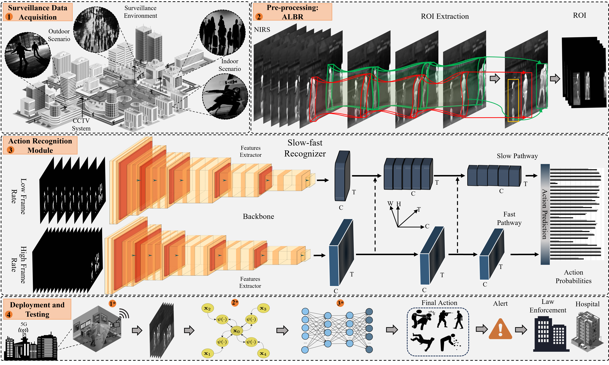

## Darkness-Adaptive Action Recognition: Leveraging Efficient Tubelet Slow-Fast Network for Industrial Applications

This paper has been published in [IEEE TRANSACTIONS ON INDUSTRIAL INFORMATICS](https://ieeexplore.ieee.org/xpl/RecentIssue.jsp?punumber=9424)

### 1. The Proposed Framework
Infrared (IR) technology has emerged as a solution for monitoring dark environments. It offers resilience to shifting illumination, appearance changes, and shadows, with applications spanning self-driving cars, robotics, nighttime security, and many other fields. While existing state-of-the-art RGB-based human action recognition (AR) models exhibit limitations in scalability for action understanding under uncertain, low-light, or dark conditions. Integrating these with IR data faces challenges due to changes in modality, high resource demands, and strict latency requirements. Such issues hinder the deployment of these technologies in real-world settings. To overcome these challenges, we introduce a novel slow-fast tubelet (SFT) processing framework designed for efficient and accurate AR in IR-based scenarios. The SFT framework comprises three modules: tubelet preprocessing (TPP), feature extraction, and the feature lateral connection and recognition module (FELCM). The TPP module refines IR streams by extracting the region of interest, filtering detected objects, removing noise, and generating tubelets of refined frames. The FELCM processes refined tubelet through two pathways, where the fast tubelet path operates at a high rate and the slow tubelet path operates at a slow rate. These pathways interconnect through lateral connections, facilitating mutual updates, and enhancing the prediction efficiency. We conducted extensive experiments on benchmark datasets, including NTURGB-D 120 and infrared action recognition (InfAR). The results demonstrate that our proposed SFT framework surpasses state-of-the-art approaches in terms of accuracy (2.7% and 3.3% improvement, respectively), computational cost, and inference latency while maintaining the competitive recognition performance. Our framework’s promising results underscore its potential for direct deployment in real-world applications.

The Proposed framework overview: Data acquisition, tubelet generation in PP, tubelet feature extraction for AR, and final prediction in the deployment section. Each numbered submodule corresponds to a specific module indicated by (*) in module 4. The system generates alerts in emergency cases for relevant departments: Hospitals, security, and law enforcement.

### 2. Datasets
The datasets can be downloaded from the following links.

Download NTURGB-D-120 dataset: [Click here](https://rose1.ntu.edu.sg/dataset/actionRecognition/)

Download InfAR dataset: [Click here](https://www.sciencedirect.com/science/article/pii/S0925231216307044)

## 3. Acknowledgements
This work was supported by National Research Foundation of Korea (NRF) grant funded by the Korea government (MSIT), Grant/Award Number:(2023R1A2C1005788).
